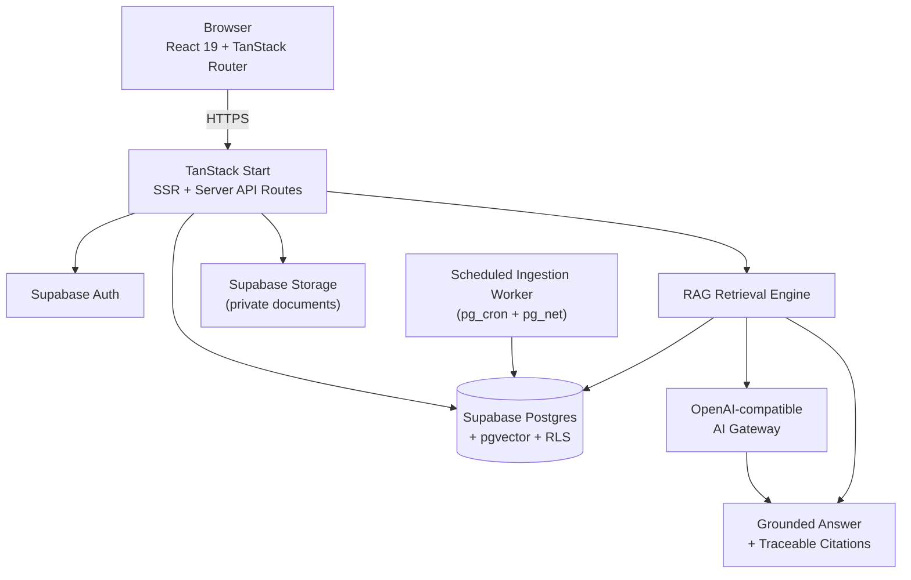
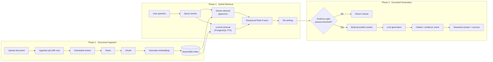
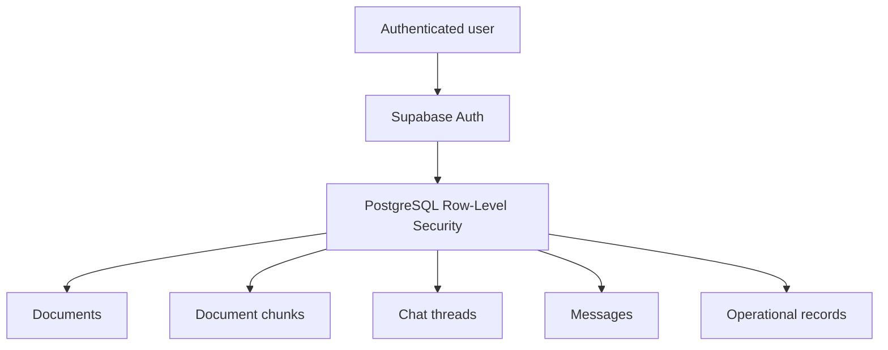

<div align="center">
  

  # QueryVault

  **AI-powered, evidence-grounded knowledge platform**

  Upload your documents, ask questions in plain English, and get answers that are grounded in your own knowledge base — with every claim traceable back to its source.

  [](./LICENSE)
  [](https://github.com/darshsoam07/QueryVault-Project/actions/workflows/ci.yml)
  
  
  
  

  [Report Bug](https://github.com/darshsoam07/QueryVault-Project/issues) · [Request Feature](https://github.com/darshsoam07/QueryVault-Project/issues)

</div>

<br/>

## 📑 Table of Contents

- [Overview](#-overview)
- [Key Features](#-key-features)
- [Architecture](#-architecture)
- [RAG Pipeline](#-rag-pipeline)
- [Tech Stack](#-tech-stack)
- [Project Structure](#-project-structure)
- [Getting Started](#-getting-started)
- [Testing & Quality Gates](#-testing--quality-gates)
- [Security Model](#-security-model)
- [Documentation](#-documentation)
- [Screenshots](#-screenshots)
- [Current Limitations](#-current-limitations)
- [Roadmap](#-roadmap)
- [Mini-Project Summary](#-mini-project-summary)
- [License](#-license)
- [Author](#-author)

<br/>

## 🎯 Overview

Traditional document search has two recurring problems:

1. **Keyword-only search misses meaning.** If the wording in a query doesn't match the wording in the document, relevant results get missed.
2. **General-purpose LLMs hallucinate.** They can produce fluent, confident answers that aren't actually backed by anything the user owns.

**QueryVault** solves both by combining hybrid retrieval with Retrieval-Augmented Generation (RAG):

```
 Naive approach:      Question ──────────────────► LLM ──────────────────► Answer (unverified)

 QueryVault approach: Question ─► Retrieve evidence ─► Build grounded context ─► Generate ─► Validate citations ─► Answer + Sources
```

Every answer QueryVault produces is checked against the retrieved evidence before it's shown to the user, and every response links back to the exact document chunks that support it.

<br/>

## ⭐ Key Features

| Category | What it does |
|---|---|
| 📄 **Document knowledge base** | Upload, track, and manage documents; source files live in private Supabase Storage; deleting a document removes its indexed chunks too. |
| 🔎 **Hybrid search** | Combines semantic similarity (`pgvector`) with keyword-aware full-text search (PostgreSQL FTS), merged via Reciprocal Rank Fusion and re-ranked before use. |
| 🤖 **Evidence-grounded answers** | An evidence gate checks similarity/rerank scores and supporting-chunk count *before* generation — if the bar isn't met, the system returns a refusal instead of guessing. |
| 💬 **Conversational Q&A** | Thread-based conversations with streaming responses, Markdown rendering, inline source citations, and full evidence inspection. |
| 🔐 **Multi-tenant security** | Supabase Auth + PostgreSQL Row-Level Security isolate every user's documents, chunks, and conversations at the database layer. |
| ⚙️ **Durable background ingestion** | Document processing runs as database-backed jobs executed by a scheduled worker, so it survives closed browser tabs and page reloads. |
| 📊 **Observability** | Health endpoints, structured telemetry, query tracing, rate limiting, and structured error handling are built in, not bolted on. |
| 🧪 **Automated validation** | An extensive automated test suite plus a dedicated RAG evaluation harness with quality gates. |

<br/>

## 🏗️ Architecture



**Design principles**

| Principle | Implementation |
|---|---|
| Grounding | Retrieved document evidence is supplied to generation, not the model's own memory |
| Traceability | Every response exposes the source chunks and citations behind it |
| Hybrid retrieval | Vector search and lexical search are fused, not used in isolation |
| Tenant isolation | PostgreSQL RLS enforces per-user data boundaries at the database level |
| Durable ingestion | Processing is represented as resumable, database-backed jobs |
| Fail-closed security | Privileged credentials and worker secrets never leave the server |
| Observability | Health checks, telemetry, and query tracing ship with the app |
| Testability | Retrieval, security, and RLS behavior are covered by automated tests |

<br/>

## 🔄 RAG Pipeline



<br/>

## 🧰 Tech Stack

| Layer | Technology | Role |
|---|---|---|
| **Frontend** | React 19 + TypeScript | Interactive product UI |
| **Application** | TanStack Start (+ TanStack Router, React Query) | Full-stack routing, SSR, and server APIs |
| **Runtime** | Node.js 22 / Nitro | Application runtime |
| **Database** | Supabase PostgreSQL | Application and RAG data |
| **Vector search** | pgvector + HNSW | Semantic retrieval |
| **Lexical search** | PostgreSQL Full-Text Search | Keyword-aware retrieval |
| **Authentication** | Supabase Auth | User authentication (email + Google OAuth) |
| **File storage** | Supabase Storage | Private document storage |
| **AI** | OpenAI-compatible AI gateway | Chat generation and embeddings |
| **Scheduling** | pg_cron + pg_net | Durable, in-database ingestion scheduling |
| **UI** | Tailwind CSS 4 + Radix UI | Design system and accessible components |
| **Testing** | Vitest + Testing Library | Automated validation |
| **CI / Deployment** | GitHub Actions + Docker | Automation and container deployment |

<br/>

## 📂 Project Structure

```
QueryVault-Project/
│
├── src/
│   ├── components/
│   │   ├── ai-elements/        # Chat / streaming UI primitives
│   │   ├── queryvault/         # Product-specific UI (sidebar, landing, knowledge panel)
│   │   └── ui/                 # Reusable design-system components
│   │
│   ├── integrations/
│   │   └── supabase/           # Supabase clients, auth middleware
│   │
│   ├── lib/
│   │   ├── config/              # Runtime / environment validation
│   │   ├── ingestion/           # Durable ingestion worker
│   │   ├── observability/       # Health, telemetry & tracing
│   │   ├── retrieval/           # RAG retrieval pipeline (dense, lexical, fusion, rerank, gate)
│   │   └── __tests__/           # Unit & integration tests
│   │
│   ├── routes/
│   │   ├── api/
│   │   │   ├── chat.ts          # Streaming chat endpoint
│   │   │   ├── health.ts        # Health endpoint
│   │   │   └── public/
│   │   │       └── worker-drain.ts   # Ingestion worker trigger
│   │   ├── auth.tsx             # Authentication
│   │   ├── chat.*.tsx           # Chat experience
│   │   └── reference.tsx        # Technical reference page
│   │
│   └── server.ts                # Server entry / startup checks
│
├── supabase/
│   ├── migrations/               # Schema, RLS policies & infrastructure
│   └── bootstrap.sql             # Consolidated one-shot provisioning
│
├── evaluation/                   # RAG evaluation dataset, metrics & runner
├── local-stack/                  # Standalone FastAPI + Chroma + Ollama reference stack (not used in production)
├── docs/                         # Deployment, security, testing & decision docs
├── ARCHITECTURE.md               # End-to-end architecture write-up
├── DESIGN.md                     # Notable design trade-offs, explained
├── CHANGELOG.md                  # Project history
├── Dockerfile
└── package.json
```

<br/>

## 🚀 Getting Started

### Prerequisites

- Node.js 22+
- npm (Bun is used only for the evaluation scripts and Docker builds)
- A [Supabase](https://supabase.com) project
- An API key for an OpenAI-compatible AI provider
- Supabase CLI (recommended, for migration-based provisioning)

### 1. Clone the repository

```bash
git clone https://github.com/darshsoam07/QueryVault-Project.git
cd QueryVault-Project
```

### 2. Install dependencies

```bash
npm install
```

### 3. Configure environment variables

```bash
cp .env.example .env
```

Then populate `.env`. The variables fall into three groups:

| Scope | Examples | Notes |
|---|---|---|
| Public (browser-visible) | `VITE_SUPABASE_URL`, `VITE_SUPABASE_PUBLISHABLE_KEY`, `VITE_SUPABASE_PROJECT_ID` | Safe to expose to the client |
| Server-only | `SUPABASE_SERVICE_ROLE_KEY`, `AI_PROVIDER`, `OPENAI_API_KEY` / `AI_API_KEY`, `INGESTION_WORKER_SECRET` | Never exposed to the browser; validated at boot |
| Runtime tuning | `PORT`, `HOST`, `QV_RELEASE` | Optional, sensible defaults provided |

> 🔒 **Never commit `.env`, service-role keys, AI provider keys, or worker secrets.**

### 4. Provision Supabase

Preferred (keeps migration history):

```bash
supabase link --project-ref <your-project-ref>
supabase db push
```

For first-time, consolidated provisioning, `supabase/bootstrap.sql` is also provided. Full walkthrough: [`docs/DEPLOYMENT.md`](./docs/DEPLOYMENT.md).

### 5. Start the app

```bash
npm run dev
```

<br/>

## 🧪 Testing & Quality Gates

```bash
npm test          # run the automated test suite
npm run typecheck # strict TypeScript checking
npm run lint      # ESLint (Prettier enforced as an error)
npm run eval      # RAG evaluation against a ground-truth dataset
npm run eval:gate # evaluation with pass/fail quality thresholds
```

| Area | Coverage |
|---|---|
| Automated unit & integration tests | Auth, documents, ingestion, config, health, client errors |
| RLS isolation tests | Every user-data table policy is verified as scoped to `auth.uid()` |
| RAG ground-truth evaluation | Factual, semantic, cross-document, multi-hop, negative, and prompt-injection cases |
| Static analysis | TypeScript strict mode + ESLint |
| CI | GitHub Actions runs typecheck → lint → test on every push and PR, fully offline (mocked Supabase & AI provider) |

<br/>

## 🔐 Security Model

Security is treated as an architectural boundary, not an afterthought.



- **Tenant isolation** — every user-owned table is protected by RLS policies scoped to `auth.uid()`.
- **Server-side secrets** — the Supabase service-role key, AI provider keys, and the ingestion worker secret stay on the server and are validated at boot; the app fails closed if any is missing.
- **Private storage** — uploaded files live in a private Supabase Storage bucket, accessed only through controlled application flows.
- **Fail-closed scheduler** — the ingestion trigger only fires when its Vault-backed secrets resolve correctly.

Full write-up: [`docs/SECURITY.md`](./docs/SECURITY.md)

<br/>

## 📚 Documentation

| Document | Description |
|---|---|
| [`ARCHITECTURE.md`](./ARCHITECTURE.md) | End-to-end system architecture |
| [`DESIGN.md`](./DESIGN.md) | Notable design trade-offs, explained in plain language |
| [`docs/DECISIONS.md`](./docs/DECISIONS.md) | Architecture Decision Records (ADRs) |
| [`docs/DEPLOYMENT.md`](./docs/DEPLOYMENT.md) | Deployment, Supabase setup, and platform choice |
| [`docs/SECURITY.md`](./docs/SECURITY.md) | Security model and considerations |
| [`docs/TESTING.md`](./docs/TESTING.md) | Test strategy and validation approach |
| [`docs/DOCKER.md`](./docs/DOCKER.md) | Docker build & run workflow |
| [`CHANGELOG.md`](./CHANGELOG.md) | Project history, phase by phase |

<br/>

## 📸 Screenshots

> Add screenshots to `assets/screenshots/` and reference them here before presenting or sharing the repository.

| | |
|---|---|
| **Dashboard** | `assets/screenshots/dashboard.png` |
| **Document upload & processing** | `assets/screenshots/document-upload.png` |
| **Chat with grounded answer** | `assets/screenshots/chat-answer.png` |
| **Retrieved evidence / citations** | `assets/screenshots/evidence-citations.png` |

<br/>

## ⚠️ Current Limitations

- The ingestion scheduler (`pg_cron` + `pg_net`) requires a live Supabase project to run in production.
- Serverless hosting (e.g. Vercel) works for the web surface, but document ingestion needs an always-on process — see the platform comparison in [`docs/DEPLOYMENT.md`](./docs/DEPLOYMENT.md).
- Live RAG evaluation depends on real AI provider and database credentials being configured.

<br/>

## 🗺️ Roadmap

- 📑 Additional document formats and richer parsing
- 🌐 Broader knowledge-source connectors
- 🧠 Improved retrieval and re-ranking strategies
- 📈 Richer evaluation dashboards
- 👥 Team / workspace administration
- 🔍 More granular evidence exploration
- ☁️ Expanded production deployment automation

<br/>

## 🎓 Mini-Project Summary

**Problem statement.** Users often need to find and understand information spread across multiple documents. Keyword search can miss semantically related content, and general-purpose LLMs can produce answers that are difficult to verify.

**Proposed solution.** QueryVault is a document-grounded conversational assistant built on Retrieval-Augmented Generation. Documents are processed into searchable chunks, relevant evidence is retrieved through hybrid search, and an LLM generates an answer constrained to that evidence.

**Key technical contributions** beyond a basic RAG prototype:

- Hybrid semantic + lexical retrieval with Reciprocal Rank Fusion
- A pre-generation evidence gate plus post-generation citation validation
- Multi-tenant isolation enforced with PostgreSQL Row-Level Security
- Durable, database-backed background ingestion (no external queue needed)
- Private, per-user document storage
- Built-in observability: health checks, telemetry, and query tracing
- Automated security, RLS, and RAG-quality test coverage

**End result:**

```
User → uploads documents → QueryVault knowledge base
User → asks a question   → Hybrid retrieval finds relevant evidence
                          → Grounded LLM generation
                          → Citation validation
                          → Answer + Sources
```

<br/>

## 📄 License

Distributed under the MIT License. See [`LICENSE`](./LICENSE) for details.

<br/>

## 👤 Author

<div align="center">

**Darsh Soam**

QueryVault — AI-powered, evidence-grounded document intelligence

[View Repository →](https://github.com/darshsoam07/QueryVault-Project)

<br/>

Built with React · TanStack Start · Supabase · PostgreSQL · pgvector · RAG

</div>
