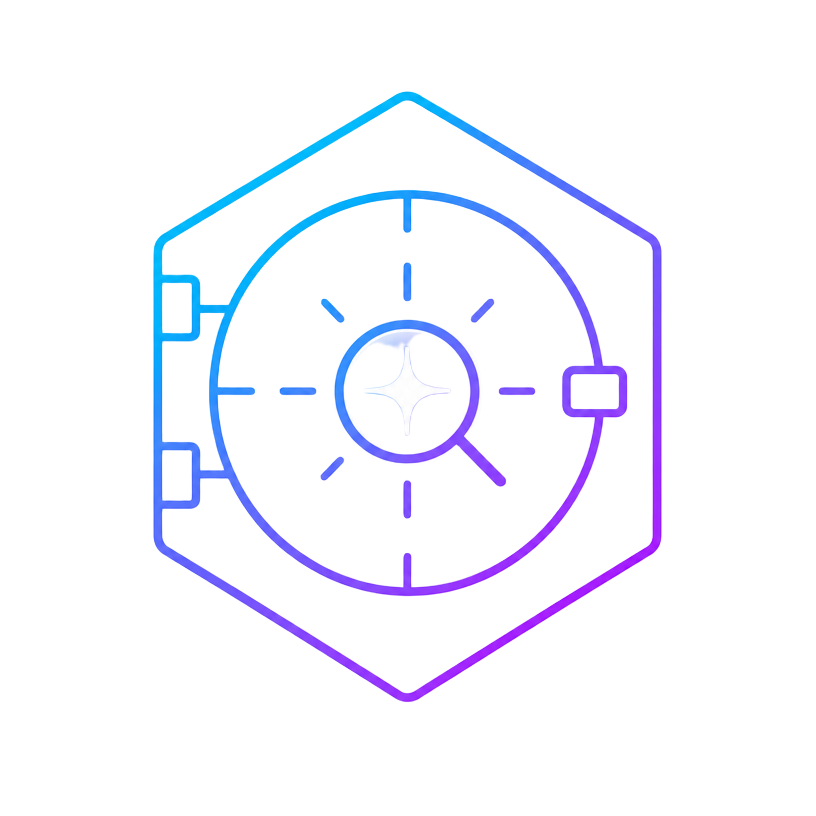

QueryVault

AI-powered, evidence-grounded knowledge platform

Upload documents → retrieve relevant evidence → generate grounded answers → inspect the sources

QueryVault is a multi-tenant RAG knowledge platform that turns your private documents into a conversational knowledge base with hybrid retrieval, evidence gating, citation validation, and database-level tenant isolation.

 

 

📖 Documentation · 🚀 Quick Start · 🏗️ Architecture · 🎥 Demo · 🐛 Report an Issue

✦ Why QueryVault?

A basic document chatbot often looks like:

Question ───────────────► LLM ───────────────► Answer

That makes it difficult to answer two important questions:

Where did this answer come from?
What should happen when the documents do not contain enough evidence?

QueryVault is built around an evidence-first pipeline:

┌──────────┐     ┌───────────────┐     ┌────────────────┐
│ Question │ ──► │ Hybrid Search │ ──► │ Evidence Gate  │
└──────────┘     └───────────────┘     └───────┬────────┘
                                               │
                                      enough evidence?
                                        ┌──────┴──────┐
                                       NO             YES
                                        │              │
                                        ▼              ▼
                                    Refusal       Grounded LLM
                                                       │
                                                       ▼
                                              Citation Validation
                                                       │
                                                       ▼
                                               Answer + Sources

The goal is not simply to generate fluent text. The goal is to make the response useful, inspectable, and grounded in the indexed knowledge base.

✨ Product Snapshot

<table>
<tr>
<td width="50%">

📄 Your Knowledge

Upload documents

Track processing status

Private document storage

Page-aware source metadata

Indexed searchable chunks

</td>
<td width="50%">

💬 Your Questions

Natural-language Q&A

Streaming responses

Conversation threads

Markdown responses

Inline source citations

</td>
</tr>
<tr>
<td>

🔎 Better Retrieval

Dense vector search

PostgreSQL full-text search

Reciprocal Rank Fusion

Re-ranking

Evidence thresholds

</td>
<td>

🔐 Production-Oriented

Supabase Auth

PostgreSQL RLS

Server-only secrets

Durable ingestion jobs

Health + telemetry + tracing

</td>
</tr>
</table>

📑 Table of Contents

<b>Explore the project</b>

✦ Why QueryVault?

✨ Product Snapshot

🎥 Demo

📸 Screenshots

🏗️ Architecture

🔄 How the RAG Pipeline Works

🧠 Retrieval Strategy

⭐ Key Engineering Decisions

🧰 Technology Stack

📂 Repository Structure

🚀 Quick Start

⚙️ Environment Configuration

🧪 Testing & Quality

🔐 Security Model

📚 Documentation

⚠️ Current Limitations

🗺️ Roadmap

🎓 Mini-Project Summary

🤝 Contributing

📄 License

👤 Author

🎥 Demo

Demo placeholder: add the final GIF at assets/demo/queryvault-demo.gif.

<!--
When the GIF is available, replace the placeholder below with:

  

-->

🎬 End-to-end product demo

[ DEMO GIF — ADD TO assets/demo/queryvault-demo.gif ]

Sign in → Upload → Ingest → Ask → Retrieve → Answer → Inspect citations

📸 Screenshots

The README is intentionally structured around the product journey so a reviewer can understand the application without reading the source first.

Screenshot location: assets/screenshots/

<!--
After adding the images, use the exact paths below.
-->

01 · Dashboard

Placeholder: assets/screenshots/dashboard.png

┌─────────────────────────────────────────────────────────────┐
│                                                             │
│              ADD QUERYVAULT DASHBOARD SCREENSHOT            │
│                                                             │
└─────────────────────────────────────────────────────────────┘

02 · Document Upload & Processing

Placeholder: assets/screenshots/document-upload.png

┌─────────────────────────────────────────────────────────────┐
│                                                             │
│          ADD DOCUMENT UPLOAD / PROCESSING SCREENSHOT        │
│                                                             │
└─────────────────────────────────────────────────────────────┘

03 · Chat + Grounded Answer

Placeholder: assets/screenshots/chat-answer.png

┌─────────────────────────────────────────────────────────────┐
│                                                             │
│             ADD CHAT + ANSWER SCREENSHOT                    │
│                                                             │
└─────────────────────────────────────────────────────────────┘

04 · Evidence & Citations

Placeholder: assets/screenshots/evidence-citations.png

┌─────────────────────────────────────────────────────────────┐
│                                                             │
│          ADD EVIDENCE / CITATIONS SCREENSHOT                │
│                                                             │
└─────────────────────────────────────────────────────────────┘

🏗️ Architecture

flowchart TB
    User["👤 User / Browser React 19"] --> App["⚡ TanStack Start SSR + Server APIs"]

    App --> Auth["🔑 Supabase Auth"]
    App --> DB[("🗄️ Supabase Postgres pgvector + RLS")]
    App --> Storage["📦 Supabase Storage Private Documents"]
    App --> RAG["🧠 RAG Retrieval Engine"]

    RAG --> DB
    RAG --> AI["🤖 OpenAI-compatible AI Gateway"]
    AI --> Answer["💬 Grounded Answer + Citations"]

    Scheduler["⏱️ pg_cron + pg_net"] --> Worker["⚙️ Ingestion Worker"]
    Worker --> DB
    Worker --> Storage

System boundaries

Boundary

Responsibility

Browser

UI, authentication flow, user interaction

TanStack Start

SSR, server routes, application orchestration

Supabase Auth

Identity and authenticated sessions

PostgreSQL + RLS

Persistent data + tenant isolation

pgvector / FTS

Semantic + lexical retrieval

Ingestion Worker

Parse → chunk → embed → index

AI Gateway

Generation and embedding requests

Supabase Storage

Private source-file storage

🔄 How the RAG Pipeline Works

① Ingestion

flowchart LR
    A["📄 Upload"] --> B["Job record"]
    B --> C["Scheduled worker"]
    C --> D["Parse"]
    D --> E["Chunk"]
    E --> F["Embeddings"]
    F --> G[("Postgres + pgvector")]

The browser creates the document/job state; processing is handled through the database-backed ingestion workflow.

② Retrieval

flowchart LR
    Q["User question"] --> R["Query processing"]
    R --> V["Dense search pgvector"]
    R --> F["Lexical search PostgreSQL FTS"]
    V --> U["Reciprocal Rank Fusion"]
    F --> U
    U --> RR["Re-ranking"]
    RR --> E["Candidate evidence"]

③ Evidence Gate

Candidate evidence
       │
       ▼
┌──────────────────────┐
│ Evidence gate checks │
│ retrieval quality    │
│ + supporting chunks  │
└──────────┬───────────┘
           │
      ┌────┴────┐
      │         │
   Fails      Passes
      │         │
      ▼         ▼
  Refusal    Grounded
              context

④ Generation + Validation

flowchart LR
    E["Retrieved evidence"] --> C["Context builder"]
    C --> P["Grounded prompt"]
    P --> L["LLM"]
    L --> V["Citation / evidence validation"]
    V --> A["Answer + Sources"]

🧠 Retrieval Strategy

QueryVault intentionally does not depend on a single search signal.

Signal

Strength

Dense vector retrieval

Finds semantically related content even when wording differs

Lexical / FTS retrieval

Preserves keyword-sensitive matching

Reciprocal Rank Fusion

Combines independent retrieval rankings

Re-ranking

Refines candidate ordering before generation

Evidence gate

Prevents generation when retrieved support is insufficient

Why hybrid retrieval?

                    QUERY
                      │
             ┌────────┴────────┐
             │                 │
        "meaning"          "wording"
             │                 │
             ▼                 ▼
        Vector Search      FTS Search
             │                 │
             └────────┬────────┘
                      ▼
                    RRF
                      │
                      ▼
                  Re-rank
                      │
                      ▼
               Stronger evidence

This gives the retrieval layer access to both semantic similarity and lexical precision.

⭐ Key Engineering Decisions

<b>Why PostgreSQL + pgvector?</b>

QueryVault keeps application data and vector retrieval in the same PostgreSQL system. This reduces the number of independent data systems required while allowing vector search, relational data, and RLS to coexist.

<b>Why hybrid retrieval instead of vector search alone?</b>

Semantic similarity is useful for conceptual matches, while lexical retrieval remains valuable when exact terminology, names, identifiers, or phrasing matter. QueryVault combines both signals before re-ranking.

<b>Why database-backed ingestion jobs?</b>

Document processing should not depend on the browser staying open. Representing ingestion work as database-backed jobs allows scheduled worker execution and clearer operational state.

<b>Why RLS?</b>

Tenant isolation is enforced at the database boundary rather than relying only on application-level filtering. This creates a stronger defense against accidental cross-user access.

<b>Why an evidence gate?</b>

Retrieval quality should influence whether generation proceeds. If the evidence boundary is not met, the system can refuse rather than manufacture a confident answer.

🧰 Technology Stack

Layer

Technology

Purpose

UI

React 19

Interactive frontend

Language

TypeScript 5.8

Type-safe application code

Full-stack

TanStack Start

SSR, routing and server APIs

Runtime

Node.js 22 / Nitro

Application runtime

Database

Supabase PostgreSQL

Application + RAG persistence

Vector search

pgvector + HNSW

Semantic retrieval

Lexical search

PostgreSQL FTS

Keyword-aware retrieval

Auth

Supabase Auth

Email + Google OAuth authentication

Storage

Supabase Storage

Private document files

AI

OpenAI-compatible gateway

Generation + embeddings

Scheduling

pg_cron + pg_net

In-database job scheduling

UI system

Tailwind CSS 4 + Radix UI

Styling + accessible primitives

Testing

Vitest + Testing Library

Automated tests

CI / Deployment

GitHub Actions + Docker

Automation + container workflows

📂 Repository Structure

QueryVault-Project/
│
├── src/
│   ├── components/
│   │   ├── ai-elements/         # Chat / streaming primitives
│   │   ├── queryvault/          # Product-specific components
│   │   └── ui/                  # Reusable UI primitives
│   │
│   ├── integrations/
│   │   └── supabase/            # Supabase clients + auth
│   │
│   ├── lib/
│   │   ├── config/              # Runtime configuration
│   │   ├── ingestion/           # Ingestion worker
│   │   ├── observability/       # Health, telemetry, tracing
│   │   └── retrieval/           # Dense, lexical, fusion, rerank, gate
│   │
│   ├── routes/
│   │   ├── api/
│   │   │   ├── chat.ts          # Streaming chat endpoint
│   │   │   ├── health.ts        # Health endpoint
│   │   │   └── public/
│   │   │       └── worker-drain.ts
│   │   ├── auth.tsx             # Authentication
│   │   ├── chat.*.tsx           # Chat routes
│   │   └── reference.tsx        # Technical reference
│   │
│   └── server.ts                # Server entry / startup checks
│
├── supabase/
│   ├── migrations/              # Schema + RLS + infrastructure
│   └── bootstrap.sql            # Consolidated provisioning
│
├── evaluation/                  # RAG dataset + evaluation runner
├── local-stack/                 # Standalone reference stack
├── docs/                        # Deployment, security, testing, ADRs
├── assets/
│   ├── screenshots/             # README screenshots
│   └── demo/                    # README demo GIF
│
├── ARCHITECTURE.md
├── DESIGN.md
├── CHANGELOG.md
├── Dockerfile
└── package.json

🚀 Quick Start

Prerequisites

Node.js 22+

npm

A Supabase project

An API key for an OpenAI-compatible AI provider

Supabase CLI recommended for migration-based provisioning

1. Clone

git clone https://github.com/darshsoam07/QueryVault-Project.git
cd QueryVault-Project

2. Install

npm install

3. Configure

cp .env.example .env

Populate the required variables.

4. Provision Supabase

Preferred migration workflow:

supabase link --project-ref <your-project-ref>
supabase db push

A consolidated provisioning script is also available:

supabase/bootstrap.sql

5. Run

npm run dev

⚙️ Environment Configuration

QueryVault separates public browser configuration from server-only secrets.

Scope

Examples

Exposure

Client-safe

VITE_SUPABASE_URL, VITE_SUPABASE_PUBLISHABLE_KEY, VITE_SUPABASE_PROJECT_ID

Browser-visible

Server-only

SUPABASE_SERVICE_ROLE_KEY, OPENAI_API_KEY / AI_API_KEY, INGESTION_WORKER_SECRET

Never expose

Runtime

PORT, HOST, QV_RELEASE

Optional tuning

🔒 Never commit .env, service-role keys, AI provider credentials, or worker secrets.

🧪 Testing & Quality

Local checks

npm test
npm run typecheck
npm run lint

RAG evaluation

npm run eval
npm run eval:gate

Validation areas

Area

What is checked

Application logic

Auth, documents, ingestion, configuration, health and client errors

RLS isolation

User-data policies remain scoped to the authenticated user

RAG quality

Factual, semantic, cross-document, multi-hop, negative and prompt-injection cases

Static analysis

TypeScript + ESLint

CI

Automated typecheck → lint → test workflow

🔐 Security Model

flowchart TD
    U["👤 Authenticated User"] --> A["Supabase Auth"]
    A --> R["PostgreSQL RLS"]

    R --> D["Documents"]
    R --> C["Document Chunks"]
    R --> T["Chat Threads"]
    R --> M["Messages"]
    R --> O["Operational Records"]

    S["Server-only secrets"] --> API["Server APIs / Worker"]
    API --> DB["Postgres"]
    API --> AI["AI Provider"]

Security boundaries

Tenant isolation — user-owned data is protected by PostgreSQL Row-Level Security.

Server-only secrets — service-role credentials, AI keys and worker secrets remain server-side.

Private storage — source documents live in private Supabase Storage.

Fail-closed configuration — required privileged configuration is validated before sensitive operations.

Worker protection — ingestion execution is authenticated rather than exposed as an unauthenticated public operation.

Security details and deployment-specific considerations are documented in docs/SECURITY.md.

📊 Quality & Architecture at a Glance

🧠 RAG

🔎 Retrieval

🔐 Security

⚙️ Operations

🧪 Validation

Grounded generation

Vector + FTS

Auth + RLS

Durable jobs

Automated tests

Evidence gate

RRF fusion

Private storage

Health checks

RAG evaluation

Citation validation

Re-ranking

Server secrets

Telemetry

Quality gates

📚 Documentation

Resource

Purpose

ARCHITECTURE.md

End-to-end system architecture

DESIGN.md

Design trade-offs and rationale

docs/DECISIONS.md

Architecture Decision Records

docs/DEPLOYMENT.md

Deployment and Supabase setup

docs/SECURITY.md

Security model

docs/TESTING.md

Testing strategy

docs/DOCKER.md

Docker workflow

CHANGELOG.md

Project history

⚠️ Current Limitations

The pg_cron + pg_net ingestion scheduler requires a live Supabase project for production execution.

Serverless hosting can serve the web surface, while ingestion requires the appropriate worker/scheduler setup.

Live RAG evaluation depends on configured AI provider and database credentials.

🗺️ Roadmap

NOW
 │
 ├── Core document-grounded Q&A
 ├── Hybrid retrieval
 ├── Evidence + citations
 ├── Multi-tenant security
 └── Durable ingestion
       │
       ▼
NEXT
 │
 ├── More document formats
 ├── More knowledge-source connectors
 ├── Retrieval / reranking improvements
 ├── Richer evaluation dashboards
 └── Team / workspace administration
       │
       ▼
LATER
 │
 ├── Deeper evidence exploration
 └── Expanded production automation

🎓 Mini-Project Summary

Problem

Information is often distributed across multiple documents. Keyword search can miss semantically related content, while general-purpose LLMs can produce answers that are difficult to verify.

Solution

QueryVault combines document ingestion, hybrid retrieval and grounded LLM generation to create a conversational knowledge assistant backed by the user's own documents.

Technical Contributions

Hybrid semantic + lexical retrieval

Reciprocal Rank Fusion

Re-ranking

Pre-generation evidence gating

Post-generation citation validation

PostgreSQL Row-Level Security

Durable database-backed ingestion

Private document storage

Health, telemetry and query tracing

Automated security and RAG-quality validation

End-to-end flow

                 ┌──────────────────┐
                 │      USER        │
                 └────────┬─────────┘
                          │
                     Upload / Ask
                          │
                          ▼
                 ┌──────────────────┐
                 │    QUERYVAULT    │
                 └────────┬─────────┘
                          │
             ┌────────────┴────────────┐
             │                         │
             ▼                         ▼
        Document Ingestion       Hybrid Retrieval
             │                         │
             ▼                         ▼
       Searchable Index          Evidence Ranking
             │                         │
             └────────────┬────────────┘
                          ▼
                   Evidence Gate
                          │
                          ▼
                   Grounded LLM
                          │
                          ▼
                 Citation Validation
                          │
                          ▼
                ┌──────────────────┐
                │ Answer + Sources │
                └──────────────────┘

🤝 Contributing

Contributions, issues and suggestions are welcome.

Fork the repository.

Create a feature branch.

Make focused changes.

Run:

npm run typecheck
npm run lint
npm test

Open a pull request with a clear description of the change.

For bugs and feature requests, use the GitHub Issues page.

📄 License

Distributed under the MIT License. See LICENSE for details.

👤 Author

Darsh Soam

QueryVault — AI-powered, evidence-grounded document intelligence

 

⭐ View Repository

Built with React · TanStack Start · Supabase · PostgreSQL · pgvector · RAG

